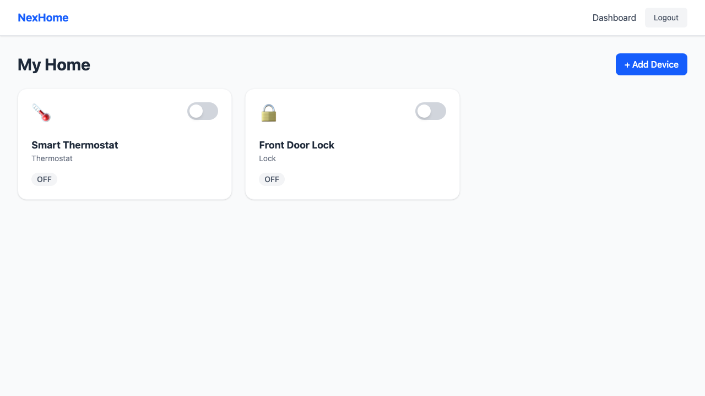
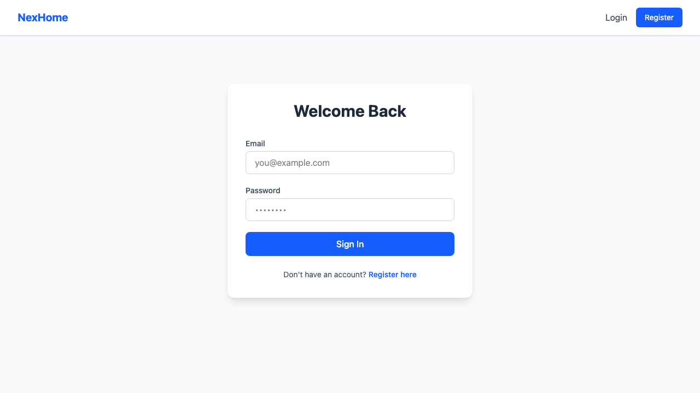
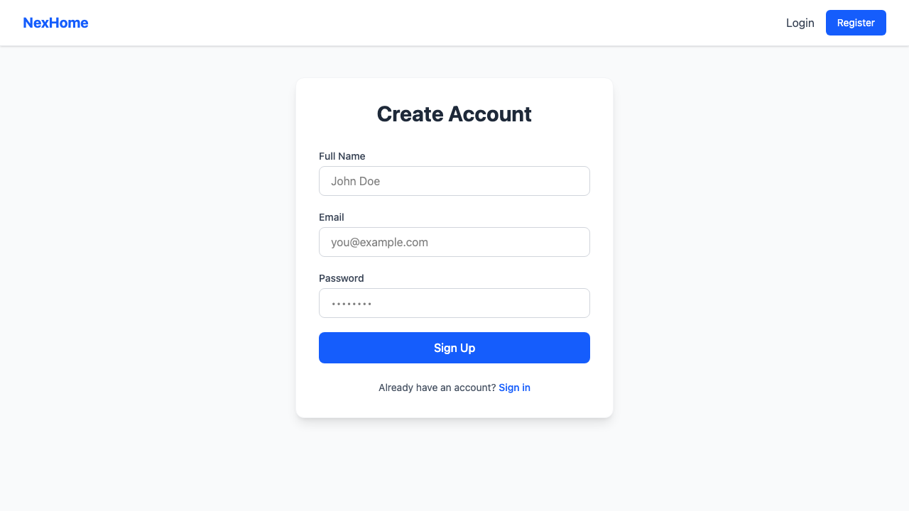

# NexHome: Smart Home IoT Platform 🏠✨



NexHome is a modern, microservices-based Smart Home IoT platform. This project serves as a comprehensive full-stack developer portfolio piece designed to demonstrate a production-inspired connected home ecosystem, clean architectural design, and the ability to build and integrate distributed systems.

## 🚀 Features

- **Secure Authentication System:** JSON Web Tokens (JWT), robust password hashing, protected API routes, and React Router private routing.
- **Dynamic Device Management:** Add, remove, and toggle smart devices directly from the UI with optimistic updates and seamless error handling.
- **Real-Time Telemetry:** Fast data ingestion via Express.js, streaming live updates directly to connected clients via Server-Sent Events (SSE).
- **Modern UI/UX:** Clean, responsive interface built with React, Vite, and Tailwind CSS.
- **Robust Testing:** E2E automation with Playwright and robust Python backend unit tests with PyTest.

## 🏗 Architecture & Tech Stack

NexHome is composed of three primary services running in tandem:

### 1. Frontend (React + Vite + Tailwind CSS)
- Located in `/frontend`.
- Provides the responsive user interface and unified global state management via the Context API.
- Connects to the Core Service via REST and to the Ingestion Service via EventSource for live updates.

### 2. Core Service (FastAPI + Python)
- Located in `/core-service`.
- Serves as the primary CRUD backend and authentication provider.
- Uses **SQLAlchemy** to manage relational data in a lightweight SQLite database.
- Implements stateless JWT authentication using `passlib` and `PyJWT`.

### 3. Ingestion Service (Express.js + Node.js)
- Located in `/ingestion-service`.
- Purpose-built for high-throughput IoT metrics ingestion.
- Exposes a `POST /telemetry` route for devices and a `GET /stream` Server-Sent Events (SSE) route to broadcast metrics directly to the React application.

---

## 📸 Screenshots

### Login & Authentication

*Secure authentication UI complete with instant form validation.*

### New Account Registration

*Registration seamlessly hashes passwords and automatically provisions JWT tokens.*

### Real-Time Device Dashboard

*Manage devices and see live telemetry changes as they happen via SSE.*

---

## 🛠 Installation & Setup

You will need three separate terminal windows to run this platform locally. Ensure you have Python 3.9+, Node.js (v18+), and `npm` installed.

### 1. Start the Core Backend (FastAPI)
```bash
cd core-service
python3 -m venv venv
source venv/bin/activate
pip install -r requirements.txt
uvicorn app.main:app --reload --port 8000
```
> The API will be available at `http://localhost:8000`. You can view the interactive Swagger docs at `http://localhost:8000/docs`.

### 2. Start the Ingestion Service (Node.js)
```bash
cd ingestion-service
npm install
npm start
```
> The ingestion service will start listening on `http://localhost:3001`.

### 3. Start the Frontend Application (React)
```bash
cd frontend
npm install
npm run dev
```
> The Vite dev server will host the application at `http://localhost:5173`.

---

## 📡 Testing Real-Time Telemetry

You can easily simulate a smart home device sending metrics (e.g., temperature) to see the real-time SSE stream in action:

1. Log into the application and add a **Thermostat** device (let's assume it gets ID `1`).
2. Run the following `curl` command to simulate the smart device pushing data:

```bash
curl -X POST http://localhost:3001/telemetry \
  -H "Content-Type: application/json" \
  -d '{"device_id": 1, "metrics": {"temperature": 23.5}}'
```

3. Watch the dashboard card update instantly without a page reload!

---

## 🧪 Running Tests

### Backend Unit Tests (PyTest)
```bash
cd core-service
source venv/bin/activate
pytest
```

### Frontend E2E Tests (Playwright)
```bash
cd frontend
npx playwright test
```

---
*Built with ❤️ to demonstrate modern microservices and real-time frontend integration.*
